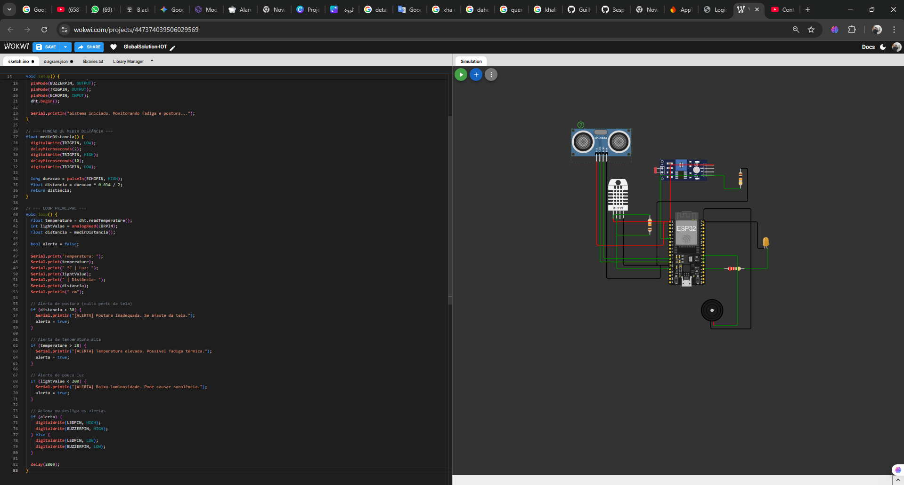
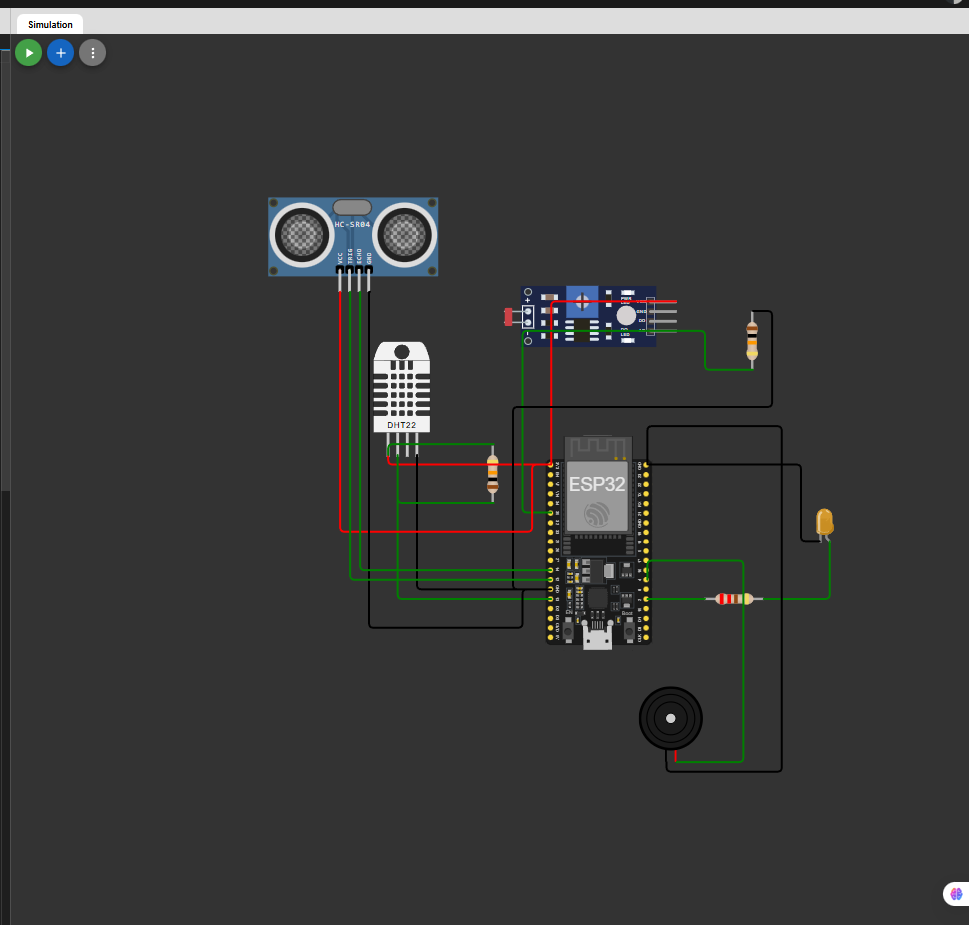

# 🌐 GLOBAL SOLUTIONS 2025 – Monitoramento de Fadiga e Postura com ESP32

## 🧠 Problema

Com o crescimento do trabalho remoto, muitos profissionais enfrentam fadiga e má postura devido à exposição prolongada a ambientes inadequados, como calor excessivo, pouca iluminação e má ergonomia.

👥 Integrantes

- Guilherme Daher – RM98611
- Gustavo Akio – RM550241
- Heitor Nobre – RM551539

## 💡 Solução

Este projeto utiliza um ESP32 com sensores de temperatura (DHT22), luminosidade (LDR) e distância (ultrassônico HC-SR04) para monitorar o ambiente e a postura do usuário. Quando detectadas condições desconfortáveis, o sistema aciona alertas visuais (LED) e sonoros (buzzer), sugerindo pausas ou correções posturais.

## 🔧 Componentes Utilizados

- ESP32
- Sensor DHT22 (temperatura)
- LDR (luminosidade)
- Sensor ultrassônico HC-SR04 (distância)
- LED
- Buzzer

## 🎥 Vídeo Explicativo

Apresentação do projeto disponível em:

🔗 [Assista no YouTube](https://youtu.be/D_8ly8-QOs4)

## 🖥️ Simulação Wokwi

- Link da simulação: [Clique aqui para acessar](https://wokwi.com/projects/447374039506029569)

## 📷 Imagem do Circuito

## 📂 Código Fonte

Arquivo: `sistema_fadiga_postura.ino`

Comentado e organizado para facilitar entendimento e modificação.

## 📡 Comunicação

Este projeto não utiliza MQTT ou HTTP devido à limitação do simulador Wokwi. A comunicação pode ser expandida futuramente com integração real via Wi-Fi e protocolos IoT.

## ✅ Resultados Esperados

- Detecção de ambientes desconfortáveis (calor + pouca luz)
- Alerta de postura inadequada (usuário muito próximo da tela)
- Sugestão de pausas inteligentes para melhorar o bem-estar

## 🚀 Impacto

A solução promove saúde e ergonomia no trabalho remoto, contribuindo para um futuro mais sustentável e produtivo.
